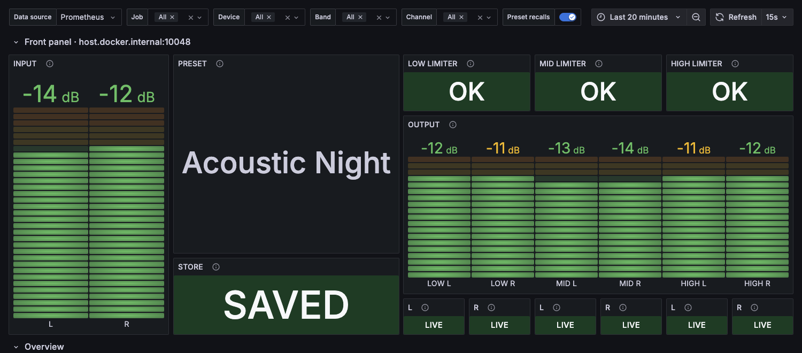

# pa2_exporter

[](https://github.com/tilmannf/pa2_exporter/actions/workflows/ci.yml)
[](LICENSE)

Prometheus exporter for the **dbx DriveRack PA2** loudspeaker management
system. Monitors levels, limiter and compressor activity, mutes, preset state
and settings changes over the PA2's network control protocol.

Written for a small live venue that wanted its PA in the same monitoring stack
as everything else: alert when the rack is dark, see how hard the limiters
worked last night, and keep an audit trail of who changed what.

> **Status: alpha.** Verified against real hardware (firmware 1.2.0.1) and
> running at one venue. Metric names and labels may still change before 1.0.

**Read-only by design.** The exporter only ever sends `connect`, `get`, `ls`
and `sub`. It never sends `set`, so it cannot change your tunings, mutes or
presets — a monitoring tool has no business touching a live PA.

Not affiliated with dbx, Harman or the DriveRack product line — see
[TRADEMARKS.md](TRADEMARKS.md).

## Quick start

```bash
docker run -d --name pa2_exporter -p 10049:10049 \
    -e PA2_HOST=192.0.2.10 \
    -e PA2_PASSWORD=secret \
    ghcr.io/tilmannf/pa2_exporter:latest      # or: tilmannf/pa2_exporter:latest

curl localhost:10049/metrics
```

Without Docker:

```bash
pip install .
PA2_HOST=192.0.2.10 PA2_PASSWORD=secret pa2-exporter
```

Prometheus scrape config:

```yaml
scrape_configs:
  - job_name: pa2
    scrape_interval: 15s        # keep PA2_WINDOW_SECONDS in sync with this
    static_configs:
      - targets: ["pa2_exporter:10049"]
```

## Configuration

| Env var | Flag | Default |
|---|---|---|
| `PA2_HOST` | `--host` | *(required)* |
| `PA2_PORT` | `--port` | `19272` |
| `PA2_PASSWORD` | `--password` | `administrator` |
| `PA2_PASSWORD_FILE` | — | *(unset)* — read the password from a file; wins over `PA2_PASSWORD` |
| `PA2_EXPORTER_ADDR` | `--listen-addr` | `0.0.0.0` |
| `PA2_EXPORTER_PORT` | `--listen-port` | `10049` (see note) |
| `PA2_WINDOW_SECONDS` | `--window` | `15` |

The password is the one set in the PA2's network security settings, which is
also what its control app asks for; `administrator` is the factory default.

Port 10049 is this exporter's allocation in the [Prometheus default port
allocation registry](https://github.com/prometheus/prometheus/wiki/Default-port-allocations).
Releases up to and including 0.2.1 defaulted to 10048, which was free when they
shipped but has since been allocated to another exporter; if you deployed one of
those, either pin `PA2_EXPORTER_PORT=10048` or move your scrape target when you
upgrade.

## Metrics

| Metric | Type | Notes |
|---|---|---|
| `pa2_up` | gauge | session alive + authenticated; device-state series are omitted while `0` |
| `pa2_input_level_db{channel,stat}` | gauge | `stat`: min/avg/max over the rolling window |
| `pa2_output_level_db{band,channel,stat}` | gauge | post-mute, per crossover band |
| `pa2_input_clip_total{channel}` | counter | input clip events |
| `pa2_output_muted{band,channel}` | gauge | 0/1 |
| `pa2_output_gain_db{band,channel}` | gauge | output trim |
| `pa2_limiter_gain_reduction_db{band,stat}` | gauge | **latched — see below** |
| `pa2_compressor_gain_reduction_db{stat}` | gauge | **latched — see below** |
| `pa2_limiter_state{band,stat}` / `pa2_compressor_state{stat}` | gauge | 0=under 1=knee 2=over |
| `pa2_limiter_enabled{band}` / `pa2_compressor_enabled` / `pa2_afs_enabled` | gauge | 0/1 |
| `pa2_afs_filters_active` | gauge | feedback suppression filters currently set |
| `pa2_preset_number`, `pa2_preset_info{number,name}` | gauge | currently loaded preset |
| `pa2_preset_modified` | gauge | unsaved front-panel tweaks |
| `pa2_settings_changes_total{module}` | counter | audit trail of tweaks |
| `pa2_preset_changes_total` | counter | preset recalls |
| `pa2_device_info{firmware,instance_name}` | gauge | device identity |
| `pa2_reconnects_total`, `pa2_last_push_timestamp_seconds` | | session health |

### Design notes

- **Meters push ~13 Hz, Prometheus scrapes every 15 s.** Sampling one value per
  scrape would alias badly and miss every transient. Fluid metrics therefore
  carry a `stat` label with **min/avg/max over a trailing rolling window**
  (`PA2_WINDOW_SECONDS` — size it to your scrape interval). Averages are
  computed in the dB domain, which keeps them comparable with a separate
  SPL-meter exporter using the same convention.
- **Quiet meters stop pushing.** A muted output stops metering entirely, so the
  window empties; those series fall back to the last pushed value instead of
  disappearing from your graphs.
- **Gain reduction is latched, not live.** `GainReductionMeter` answers the
  initial `sub` and then never updates again — not by push, and not by polling
  either (112 `get`s over 45 s of live music returned a byte-identical value
  while the limiter oscillated between under and knee). The exporter reports
  what the device says, so these two series only ever change on reconnect.
  Treat them as unreliable; **use `pa2_limiter_state` instead** to see how hard
  the limiters are working. Both metrics are kept rather than dropped, in case
  other firmware revisions behave differently — if yours does, please open an
  issue.
- **State that the device stops serving goes away.** Subscriptions are
  re-established on every reconnect and the device answers each one with the
  current value, so a session repopulates in milliseconds. What does not come
  back is dropped: load a 2-way preset and the mid-band limiter series vanish
  rather than reporting whatever they said under the last 3-way preset.
- **A dark device reports nothing rather than something stale.** While the PA2
  is unreachable the exporter still serves `/metrics` with `pa2_up 0`, but
  stops emitting device-state series entirely — a frozen meter reading is
  indistinguishable from a live one on a dashboard and would latch alerting
  rules. Counters keep their totals;
  `pa2_last_push_timestamp_seconds` tells you how long it has been dark.
- **Reconnects on its own** with exponential backoff (5 s → 60 s), and treats a
  silent socket as dead after 60 s, since a healthy PA2 never stops pushing.
- Single TCP session, no on-disk state, logs to stdout.

## Docker

Images are published to both registries, identical content, multi-arch
(amd64 + arm64):

- `ghcr.io/tilmannf/pa2_exporter`
- `tilmannf/pa2_exporter` (Docker Hub)

Tags: `latest`, `X.Y.Z`, `X.Y`, and `sha-<commit>`. Pin a version for
production; `latest` moves.

See [`docker-compose.yml`](docker-compose.yml) for a deployment using Docker
secrets.

- ~65 MB Alpine image, runs as non-root uid 10001, works with a read-only root
  filesystem and all capabilities dropped
- Prefer `PA2_PASSWORD_FILE` over `PA2_PASSWORD`: the file form keeps the
  password out of the process environment, where `docker inspect` exposes it
- `HEALTHCHECK` probes `/metrics` only, and deliberately ignores `pa2_up`: an
  unreachable PA2 is a working exporter reporting a real fact, and failing
  health there would restart-loop the container every time the venue powers the
  rack down
- Handles `SIGTERM`, so `docker stop` returns immediately

## Grafana dashboard

[`grafana/pa2_exporter-dashboard.json`](grafana/pa2_exporter-dashboard.json) —
import via **Dashboards → New → Import → Upload JSON**, then pick your
Prometheus data source.

The file uses Grafana's **schema v2** (`elements` + `layout`), which needs
**Grafana 13 or newer**. Two consequences worth knowing before you deploy it:

- **File provisioning does not work.** A v2 dashboard dropped into a
  provisioning directory is rejected with `dashboard appears to be in v2
  format. Please use the /apis/dashboard.grafana.app/v2 API`. To automate the
  import, POST it as a resource instead:

  ```bash
  # GRAFANA_TOKEN: a service account token with the Dashboards:write
  # permission — Administration → Users and access → Service accounts.
  jq '{apiVersion: "dashboard.grafana.app/v2", kind: "Dashboard",
       metadata: {name: "pa2-exporter"}, spec: .}' \
     grafana/pa2_exporter-dashboard.json \
   | curl -H "Authorization: Bearer $GRAFANA_TOKEN" \
          -H 'Content-Type: application/json' \
          -X POST --data-binary @- \
       http://grafana:3000/apis/dashboard.grafana.app/v2/namespaces/default/dashboards
  ```

  Repeat imports need the current `metadata.resourceVersion` and a `PUT` to
  `.../dashboards/pa2-exporter`.
- **grafana.com sharing expects the classic format**, so this file cannot be
  published there as-is.



The top row deliberately mirrors the PA2's own front panel, so anyone who
works the room can read it without knowing anything about Prometheus: input
meters on the left, the loaded preset and a STORE lamp for unsaved edits in
the middle, then LOW/MID/HIGH output meters with a limiter lamp above each
band and mute lamps beneath each channel. Everything below that row is the
engineering view.

Variables: **Data source**, **Job**, **Device**. Device is single-select on
purpose — one PA2 at a time. Showing several at once would put identically
named series on the same axes (`low deepest` twice, with nothing to tell them
apart), so the dashboard trades fleet-wide overlays for legends that always
mean one thing. Switching rooms is a dropdown away.

What it shows:

- **Front panel** — hardware-style meters and lamps, as above
- **Overview** — peak input and furthest limiter state across the range, clip
  count, whether anything is muted, availability, age of the newest pushed
  value, reconnects, firmware
- **Program levels** — both input channels in one panel, each drawn as a
  shaded peak/floor band around its average, and post-mute output level for
  each crossover band
- **Dynamics** — limiter activity per band (mean threshold state, the honest
  answer to "how hard are they working"), threshold state as a state timeline
  (under/knee/over), compressor activity, input clips
- **Routing and audit** — mute state timeline, output trim, active feedback
  suppression filters, and settings changes per module, with preset recalls
  marked as annotations across the time series

Because the exporter stops publishing device state while the PA2 is
unreachable, outages appear as honest gaps in the graphs rather than flat lines
holding the last value.

## Alerting

[`examples/alerts.yml`](examples/alerts.yml) — seven rules, from "the exporter
stopped answering" to "somebody was in the rack at four in the morning".
[`examples/prometheus.yml`](examples/prometheus.yml) is a minimal config that
loads them.

| Alert | Fires when |
|---|---|
| `PA2ExporterDown` | the exporter is not being scraped for 5 m |
| `PA2Down` | the exporter is up but has no session with the rack for 5 m |
| `PA2Stale` | the session is open but the device has pushed nothing for a minute |
| `PA2InputClipping` | any input clip in the last 5 m |
| `PA2LimiterWorkingHard` | a band sits at or past its limiter knee for a sustained stretch |
| `PA2SettingsChangedOffHours` | settings change outside the hours anyone should be at the rack |
| `PA2PresetUnsaved` | front-panel edits left unstored for an hour |

Thresholds come from one venue and are meant to be edited — a festival stage
running the PA into limiting on purpose wants `PA2LimiterWorkingHard` gone
entirely, and the off-hours window is UTC and specific to one room's schedule.

Two rules deserve their reasoning stated out loud:

- **`PA2Stale` exists because `pa2_up` is not enough.** A session can stay open
  while the device stops saying anything, and a socket that is connected but
  silent looks identical to a quiet room on every other metric.
- **Nothing alerts on `pa2_limiter_gain_reduction_db`.** That meter is latched
  on the device, so a rule built on it would be comparing thresholds against a
  value frozen at connect time. `pa2_limiter_state` comes from the meter that
  actually moves.

Every rule has a test in [`examples/alerts_test.yml`](examples/alerts_test.yml),
including negative cases — a limiter catching two transients must not page
anyone. CI runs them:

```bash
docker run --rm --entrypoint=/bin/promtool -v "$PWD/examples:/w" -w /w \
    prom/prometheus:v3.14.0 test rules alerts_test.yml
```

## How it works

The PA2 speaks a line-based ASCII protocol on **TCP port 19272** — the same
interface its control apps use:

```
HiQnet Console                                    <- greeting
connect administrator "secret"                    -> authenticate
get "\\Node\AT\Software_Version"                  -> read one value
sub "\\Preset\InputMeters\SV\LeftInput\*"         -> subscribe
subr "\\Preset\InputMeters\SV\LeftInput\*" "-97.7dB" "-97.717674" ...
set  "\\Preset\InputMeters\SV\LeftInput\*" "-96.9dB" "-96.854118" ...
```

A subscription returns its current value as a `subr` line, then the device
pushes every change as a `set` line — meters at roughly 13 Hz, settings when
somebody touches them. `ls` browses the parameter tree. Node names contain
spaces (`High Outputs Limiter`), so paths must be quoted.

`pa2_poc.py` is the standalone protocol explorer this was built from — stdlib
only, useful for finding paths on your own unit:

```bash
python3 pa2_poc.py                 # connect, subscribe, print live values
python3 pa2_poc.py --explore       # dump the parameter tree roots
python3 pa2_poc.py --ls '\\Preset\OutputGains\SV'   # inspect one node
```

## Other DriveRack models

Verified only on a **DriveRack PA2, firmware 1.2.0.1**. If you run a different
firmware, `--explore` will tell you quickly whether the paths still match.

The **VENU360** is the PA2's sibling from the same generation and its manual
describes the same network security model, so it very likely speaks the same
console protocol — but nobody has published a confirmation, and its parameter
paths would differ regardless: it is 3-in/6-out with flexible routing, where
this exporter hardcodes the PA2's fixed stereo three-way layout in
`FLUID`/`STATE`. Auth and parsing would port unchanged; the path tables would
need rewriting. **Reports from VENU360 owners are very welcome.**

Older DriveRacks are out of scope: the 260 and PA+ are RS-232 only, and the
4800/4820 speak binary HiQnet to System Architect rather than this text
console.

## Development

```bash
pip install -e ".[dev]"
pytest          # 18 tests, no hardware required
ruff check .
```

Tests drive the reader with protocol lines recorded from a real PA2 against a
stub socket, covering parsing, rolling-window statistics, clip edge detection,
settings accounting and the disconnected-collector path — all offline.

### Working without a PA2

[`tools/mock_pa2.py`](tools/mock_pa2.py) is a fake device that speaks the
console protocol well enough to drive the exporter for real:

```bash
python3 tools/mock_pa2.py &
PA2_HOST=127.0.0.1 PA2_PORT=19998 pa2-exporter
```

It simulates a show rather than idling — a music-like envelope with quiet
passages, limiters biting on peaks, input clips, preset recalls and operator
tweaks — so every panel and alert has something to display. Any password is
accepted, and `--tweak-interval` controls how often the simulated operator
touches something.

It also reproduces the hardware's *awkward* behaviour, not just the convenient
parts: `GainReductionMeter` is latched rather than animated, because an earlier
version of this mock pushed a plausible-looking value and taught us a model the
real device does not honour. If you extend the mock, copy what the PA2 actually
does — a mock that is nicer than the hardware is worse than no mock.

CI runs lint and tests on Python 3.9 and 3.12, scans history with `gitleaks`,
builds the image for amd64 and arm64, and smoke-tests the container against an
unreachable device. Tagging `v*` publishes multi-arch images to GHCR.

## Contributing

Issues and pull requests welcome — especially:

- results from other firmware versions or DriveRack models
- parameter paths this exporter does not expose yet
- Grafana dashboards and alert rules

Please keep the read-only guarantee intact: no `set` commands, ever. And never
commit a device password — CI runs `gitleaks`, but the first line of defence is
`PA2_PASSWORD_FILE`.

[CONTRIBUTING.md](CONTRIBUTING.md) has the development loop, the hardware-free
workflow and what a pull request needs. A report from a model or firmware this
has never seen is welcome even when nothing worked — the issue templates ask for
the parameter tree dump, which is the part that makes support possible.

Found a vulnerability? [SECURITY.md](SECURITY.md) — please don't open a public
issue for one.

## Credits

- **[ForsakenHarmony's protocol notes](https://gist.github.com/ForsakenHarmony/8526cbf73e9bea9cf9811490fb743fc9)**
  — the starting point for this project. Documented the port, the `connect
  administrator` handshake and the `get`/`sub` verbs, which is exactly the part
  that is painful to discover from scratch. Everything beyond that (meter,
  limiter, AFS and preset paths, and the `subr`-vs-`set` push semantics) was
  probed against live hardware here.
- Harman's [HiQnet](https://wiki.wireshark.org/HiQnet) family of protocols, of
  which this text console is a relative.

### Related projects

Independent efforts against the same device, found after this one was written —
worth a look if this exporter is not what you need:

- [tcdent/dbxview](https://github.com/tcdent/dbxview) — experimental
  alternative control interface for the PA2
- [mkupferman/lpif-dbxdriverack](https://github.com/mkupferman/lpif-dbxdriverack)
  — pushes Loudspeaker Processor Interchange Format tunings to DriveRack units

## Roadmap

- [x] Protocol PoC against real hardware
- [x] Exporter with reconnect loop and rolling-window statistics
- [x] Dockerfile + compose example
- [x] Tests, lint, secret scanning, multi-arch CI + GHCR release workflow
- [x] Published multi-arch images on GHCR and Docker Hub
- [x] Grafana dashboard
- [x] Alert rules

## License

[MIT](LICENSE)
